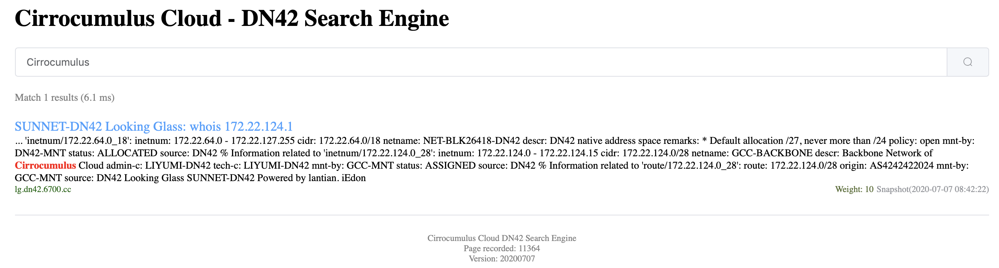

# DN42 Search Engine

基于Flask和bs4实现的轻量级搜索引擎和爬虫。目标是爬取DN42相关页面（特别是DN42内网）并支持搜索。

目前索引使用json数据存储，不适合爬取大量页面（DN42内网页面不多）。

暂时只支持英文搜索，并且区分大小写、时态等等。（按空格分词，完美匹配单个单词）

## Usage

运行一次`spider.py`会爬取一次页面，并保存索引和下次爬取的URL列表。

多次运行`spider.py`，会爬取越来越多的页面。

运行`main.py`，读取索引文件，然后监听8080端口，可以通过`http://localhost:8080/`访问。

## Screenshot

